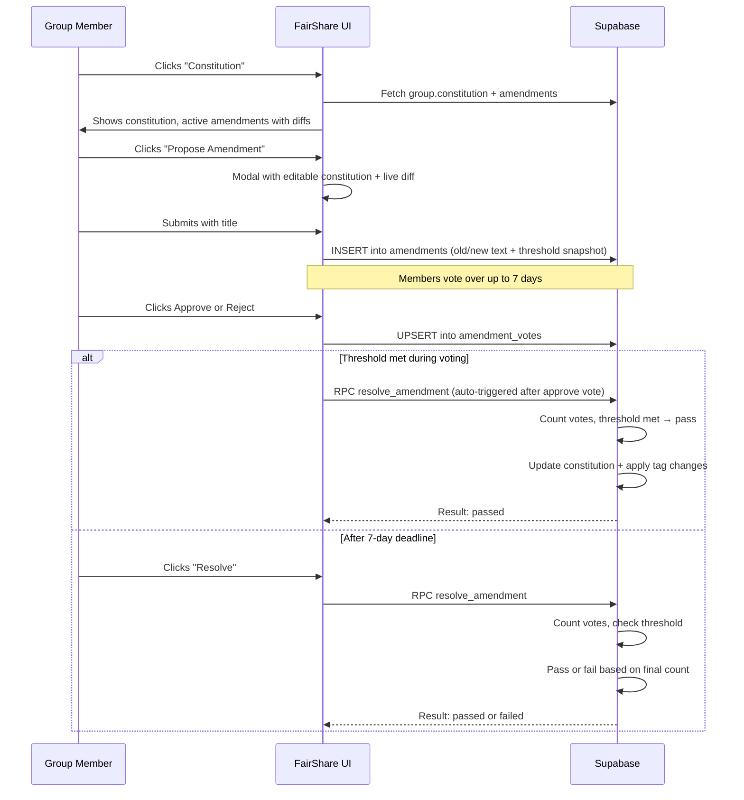

# Group Constitution and Amendment System

## Overview

Each group has a text constitution with machine-readable tagged variables. Any active member can propose amendments, which are voted on over a 7-day period and require a configurable approval threshold to pass. When an amendment passes, tagged variable changes are automatically applied to the group's settings. Amendment history is preserved with full voting records.

## Constitution Format

The constitution is a plain text document stored in the `groups.constitution` column. Lines can end with `$IDENTIFIER` tags that link human-readable values to system variables:

```
Group Name: My Community $GROUP_NAME
Currency Name: dollars $CURRENCY_NAME
Currency Symbol: $ $CURRENCY_SYMBOL
Approve New Member: 100% members $NEW_MEMBER_PERCENTAGE
Approve Amendment: 100% members $AMENDMENT_PERCENTAGE
```

When an amendment changes a tagged value and passes, the `resolve_amendment` function parses the new text, extracts the value between the colon and the tag, and applies it to the corresponding database column.

### Supported Tags

| Tag | Effect when changed |
|-----|-------------------|
| `$GROUP_NAME` | Updates `groups.name` |
| `$CURRENCY_NAME` | Updates `groups.currency_name` |
| `$CURRENCY_SYMBOL` | Updates `groups.currency_symbol` |
| `$NEW_MEMBER_PERCENTAGE` | Read at endorsement time from constitution text |
| `$AMENDMENT_PERCENTAGE` | Snapshot stored on each new amendment proposal |
| `$CHANGE_CURRENCY_RATES_PERCENTAGE` | Read at vote time by `compute_tally`; controls when enough members have voted to apply median fee rate / daily income (default 66%) |

### Adding New Tags

The tag system is extensible. To add a new tag:

1. Add a `WHEN` clause to the `CASE` block in the `resolve_amendment` SQL function
2. Map the tag to the appropriate database column update
3. Add the line to the default constitution in `createGroup()` in `fairshare.html`

Tags that don't map to a database column (like `$AMENDMENT_PERCENTAGE`) can be read directly from the constitution text at the point they're needed.

## Schema

### Constitution column on groups

```sql
alter table public.groups add column constitution text;
```

### Amendments table

```sql
create table public.amendments (
  id uuid primary key default gen_random_uuid(),
  group_id uuid not null references public.groups(id) on delete cascade,
  proposed_by uuid not null references public.profiles(id),
  title text not null,
  old_text text not null,       -- constitution snapshot at proposal time
  new_text text not null,       -- proposed new constitution
  status text not null default 'voting'
    check (status in ('voting', 'passed', 'failed', 'withdrawn')),
  threshold numeric not null,   -- snapshot of $AMENDMENT_PERCENTAGE (0-1)
  created_at timestamptz default now(),
  expires_at timestamptz default (now() + interval '7 days'),
  resolved_at timestamptz
);
```

### Amendment votes table

```sql
create table public.amendment_votes (
  id uuid primary key default gen_random_uuid(),
  amendment_id uuid not null references public.amendments(id) on delete cascade,
  user_id uuid not null references public.profiles(id),
  vote boolean not null,       -- true = approve, false = reject
  created_at timestamptz default now(),
  unique(amendment_id, user_id)
);
```

## Resolution Logic

The `resolve_amendment` function (PostgreSQL, `SECURITY DEFINER`):

1. Verifies the amendment is in `voting` status and the caller is an active group member
2. Counts approval votes vs. active member count
3. If the threshold is met (approvals / active members ≥ threshold), the amendment passes immediately — even before the 7-day deadline
4. If the deadline has passed and the threshold is not met, the amendment fails
5. If the deadline hasn't passed and the threshold isn't met, voting continues (no resolution)
6. On pass: updates `groups.constitution`, parses `$TAG` values line by line, and applies changes via a `CASE` block
7. Sets `resolved_at = now()` and updates status to `passed` or `failed`

## User Interface

### Constitution View

Accessed via the "Constitution" button in the group action grid. Shows:

- Current constitution text with `$TAG` identifiers highlighted
- "Propose an Amendment" button
- Active amendments (status = `voting`) with:
  - Word-level redline diff (insertions in green, deletions in red strikethrough)
  - Vote progress bar with threshold marker
  - Time remaining or "Expired" indicator
  - Approve / Reject buttons (or "Approved" / "Rejected" if already voted)
  - Withdraw button (for the proposer)
  - Resolve button (for expired amendments)
- Amendment history (passed/failed/withdrawn) with diffs and vote tallies

### Propose Amendment Modal

- Title field for a short summary
- Textarea pre-filled with the current constitution text
- Live redline diff preview that updates as you type
- Submit creates an `amendments` row with the current threshold snapshotted

### Word-Level Diff

A pure JavaScript implementation (~40 lines) using a longest common subsequence (LCS) algorithm. Splits old and new text into words, computes the diff, and produces `<ins>` (insertion) and `<del>` (deletion) HTML spans. No external dependencies.

## Flow


